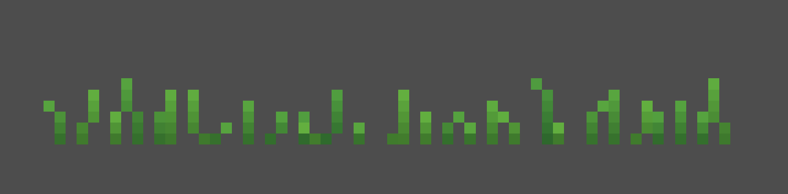
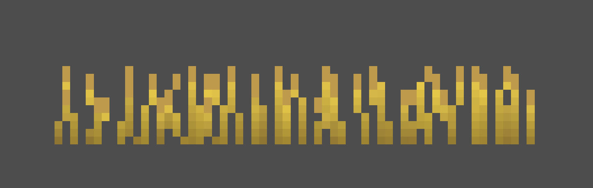
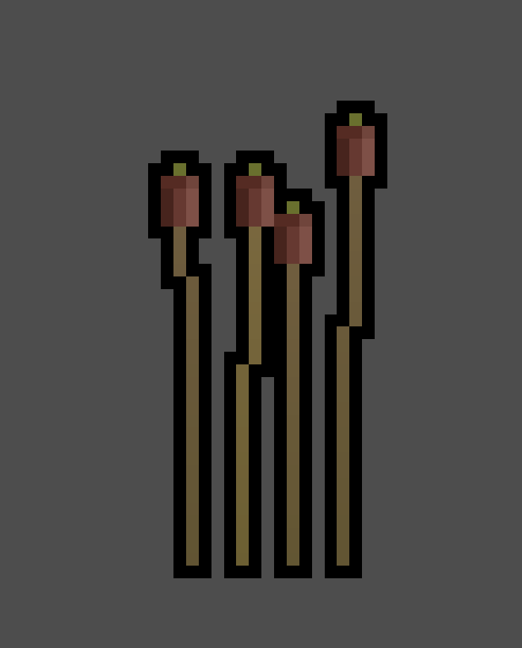
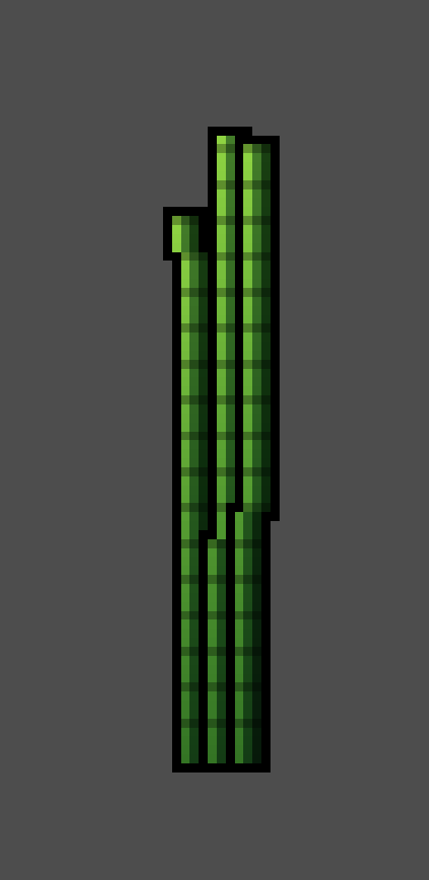
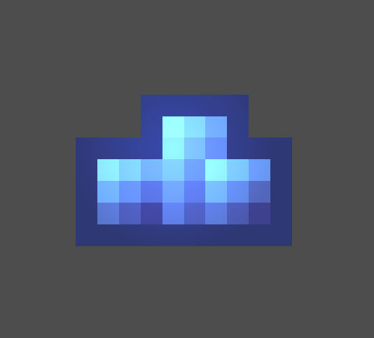
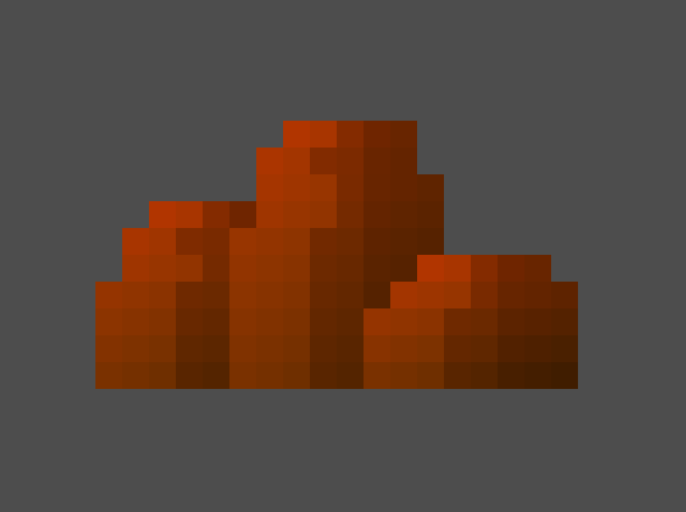

# Procedural Pixel Art Grass for Godot 4

A single `@tool` script that generates procedural pixel art grass, reeds, roots, wheat, bamboo, and more — directly in the Godot editor. No external dependencies. Just drop it in your project.

  
  

  
  
  
  

## Features

### Blades
- **Randomized blades**: configurable count, height range, and width range per patch
- **Growth direction**: angle-based growth (not just upward — roots, hanging vines)
- **Taper curve**: control how blades narrow from base to tip (pointy, rectangular, bulbous)
- **Blade curve**: adjustable curvature per blade (0 = straight rocks, 2 = very bendy)
- **Segment spacing**: dark stripes for segmented look (bamboo, reeds)
- **Tip textures**: optional sprites on blade tips (flowers, wheat ears, sakura petals)

### Colors
- **Main color**: single color per patch, with gradient and hue shift for variation
- **Color palette**: optional list of colors — each blade picks a random one
- **Per-blade color variation**: subtle randomness between blades
- **3-color shading**: diagonal light/mid/dark bands for volume (rocks, crystals)
- **Shading gradient**: diagonal brightness variation (top-left bright, bottom-right dark)
- **Hue shift**: warm-to-cool hue variation along the gradient

### Outline
- **Per-blade or total**: outline each blade individually, or the combined shape
- **Configurable thickness**: 1-10px outline
- **Wraps around tips**: outline includes tip textures

### Animation
- **Ambient sway**: continuous sine-wave oscillation with configurable speed and amplitude
- **Player interaction**: proximity-triggered wobble + directional push when the player walks through
- **Smooth decay**: natural return to rest after player passes
- **Per-blade phase offsets**: each blade moves independently for organic motion

### Rendering
- **Baked texture** in editor for zero-cost static display
- **Pixel-by-pixel rendering** via `_draw()` for animated mode
- **Screen culling** via VisibleOnScreenNotifier2D — zero cost when off-screen
- **Optional PointLight2D**: real light for glowing vegetation (firefly grass, bioluminescent plants)
- **Deterministic seed**: same position = same grass, every time

## Quick Start

1. Copy `GrassPatch.gd` into your Godot 4 project
2. Create a new `Node2D` scene and attach the script
3. Tweak parameters in the Inspector — everything updates in real-time

Or open the included `grass_patch.tscn` scene directly.

## What Can You Make?

| Type | Key Parameters |
|------|---------------|
| **Grass** | Default settings, green main_color, short blades |
| **Tall grass** | Higher max_blade_height, more blade_count |
| **Wheat** | Tip texture (wheat ear sprite), segment_spacing, golden main_color |
| **Bamboo** | Tall blades, segment_spacing, wider blade_width |
| **Reeds** | Tall, thin, slight sway, brownish main_color |
| **Roots** | grow_angle = 180 (downward), dark brown main_color |
| **Hanging vines** | grow_angle = 180, green, high sway |
| **Wildflowers** | Tip texture (flower sprites), color_palette with multiple colors |
| **Sakura petals** | Pink main_color, tip texture, high scatter |
| **Crystal grass** | Cyan/purple main_color, light_enabled, low sway, use_3color_shading |
| **Rocks** | blade_curve_amount = 0, blade_width_top = blade_width, use_3color_shading |

## Parameters

| Group | Parameters |
|-------|-----------|
| **Patch** | patch_width, blade_count, max/min_blade_height, blade_width_min/max, blade_width_top, blade_taper_curve, segment_spacing, grow_angle, blade_curve_amount |
| **Colors** | main_color, color_variation_amount, color_palette |
| **Outline** | outline_enabled, outline_mode (PER_BLADE / TOTAL), outline_color, outline_thickness |
| **Shading** | use_3color_shading, shading_gradient, hue_shift_amount, shading_color_light/mid/dark |
| **Ambient Sway** | ambient_speed, ambient_amplitude |
| **Player Sway** | player_sway_amplitude, decay_speed, detect_radius |
| **Tip Texture** | tip_texture, tip_offset |
| **Light** | light_enabled, light_energy |
| **Animation** | editor_preview_animation |
| **Generation** | noise_seed |

## Requirements

- **Godot 4.3+** (tested on 4.4 and 4.6)
- No plugins, no dependencies, no autoloads
- Works with any renderer (Forward+, Mobile, Compatibility)
- Player interaction requires a node in the `"player"` group

## Tips

- Set `texture_filter` to **Nearest** in your project settings for crisp pixel art
- Use `grow_angle = 180` to make roots or hanging vegetation
- Combine multiple GrassPatch instances with different colors for variety
- Use `color_palette` with several colors for wildflower meadows
- The `noise_seed` parameter (0 = auto per instance) ensures deterministic generation
- Add a tip texture sprite for flowers, wheat ears, or decorative tips
- Enable `shading_gradient` + `hue_shift_amount` for natural color variation without needing two colors

## License

MIT — use it however you want, credit appreciated.
